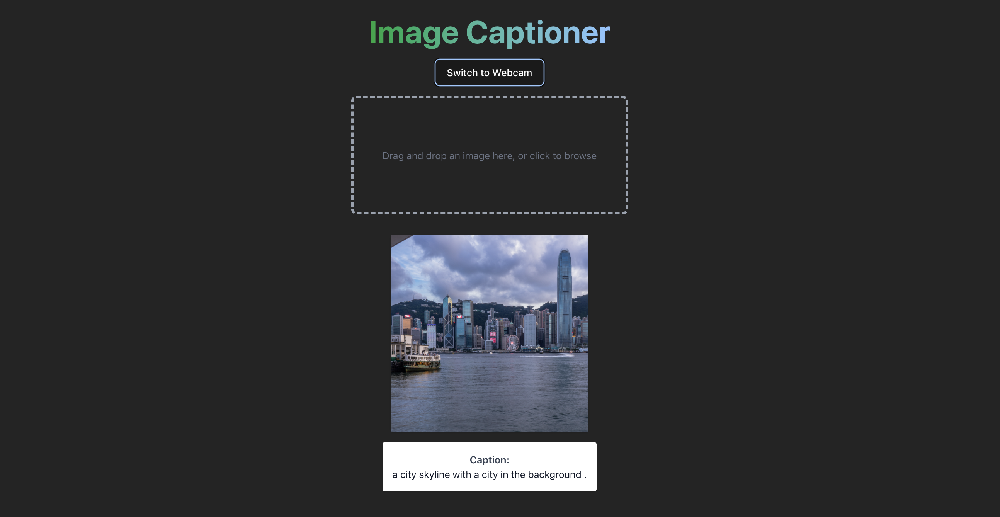

# Image Captioning with Transformers

Task: To generate captions of an image




Use `transformers` library
- Wrappers around pre-trained models

## Method

We use image embeddings from the CLIP vision transformer and a 

### CLIP

CLIP jointly represents images and text decriptions.
- 2 encoders
    - Vision encoder: ViT
    - Text encoder: A 63M-parameter 12layer 512-wide model with 8 attention heads
- Implementation on HuggingFace
    -   CLIPTextModelWithProjection
    -   Outputs a sentence projection, which are pooled (EOS token) states
    - Automatically pads with [SOS] and [EOS] tokens. The pad token is also the [EOS] token

Tokeniser should belong in the collate_fn to take advantage of the parallelisable inputs.

## Deployment

Want
- Frontend: Livestream from camera on phone, fallback is just 1 image
- Send images to FASTAPI
- Fast API runs sequential intference
- Sends message back
- Phone reads out message

## Setup

```bash
# Setup environment
source ./setup_env.sh
```

### Training
```
python3 training/train_captioner.py --log-to-wandb --wandb_checkpoint kwokkenton-individual/mlx-week4-image-captioning/transformer_captioner:v1
```

### Frontend

```
sudo apt install npm
npm install tailwindcss @tailwindcss/vite
```

Hooks
- Allow us to visualise intermediate activations

### Backend
```
uvicorn main:app --reload
```

## References

Mokady, Ron, Amir Hertz, and Amit H. Bermano. ‘ClipCap: CLIP Prefix for Image Captioning’. arXiv, 18 November 2021. https://doi.org/10.48550/arXiv.2111.09734.

https://www.digitalocean.com/community/tutorials/pytorch-hooks-gradient-clipping-debugging