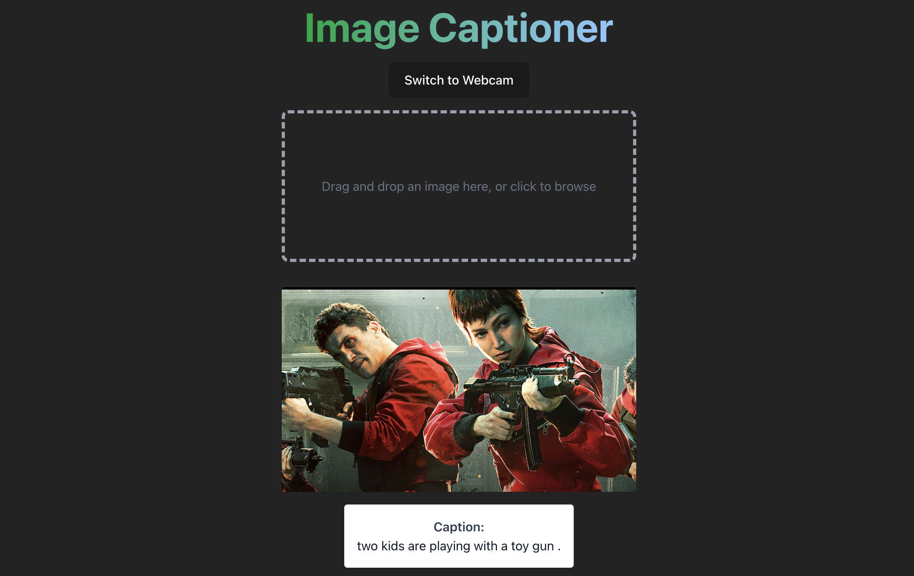
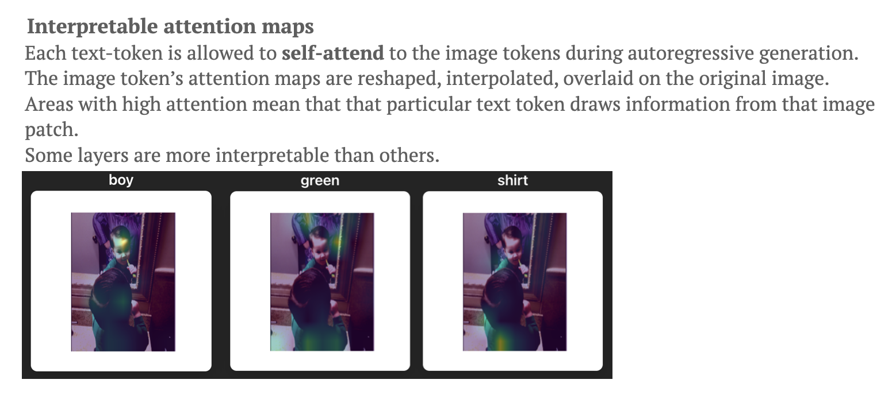

# Image Captioning with Transformers

Task: This week's task is to generate captions of an image.

<!--  -->



## Method

We use image embeddings from the CLIP vision and text transformers and a custom built decoder.

### CLIP (Radford et al 2021)

CLIP jointly represents images and text descriptions by (pre) training on 400 million image, text pairs.

- 2 encoders
  - Vision encoder: ViT
  - Text encoder: A 63M-parameter 12 layer 512-wide model with 8 attention heads
- Implementation on HuggingFace
  - CLIPTextModelWithProjection
  - Outputs a sentence projection, which are pooled (EOS token) states
  - Automatically pads with [SOS] and [EOS] tokens. The pad token is also the [EOS] token

Tokeniser should belong in the collate_fn to take advantage of the parallelisable inputs.

### Transformer Decoder

I used the standard transformer decoder implementation with hidden dimension of 512, 8 heads and 6 layers. However, there was a large gap between the training loss and validation loss, and also with the accuracy.

### Dataset and evaluation

We used Flickr30k as the dataset, which consists of images paired together with 5 human-written captions. At first we chose to develop based on the first caption only but the model quickly overfitted, so we then chose a random caption amongst the 5.

A simple metric to evaluate the model was per-token accuracy. Some more advanced methods may use BLEU or other related metrics.

### Deployment

The frontend was made using React with tailwind CSS. Features included

- drag and drop
- switch between webcam and image views

The backend (in Python) was made using FastAPI, which calls a model artifact from Weights and Biases.

## Visualising attention maps

I played with this a little bit as I wanted to extract the attention weights from the model. The trick was to subclass the `nn.TransformerEncoderLayer` which will allow loading of the model state dicts.

```python
class TransformerEncoderLayerWithAttn(nn.TransformerEncoderLayer):
    def __init__(self, *args, **kwargs):
        super().__init__(*args, **kwargs)

    def forward(self, src, src_mask=None, src_key_padding_mask=None):
        # Extract attention weights
        src2, attn_weights = self.self_attn(
            src, src, src,
            attn_mask=src_mask,
            key_padding_mask=src_key_padding_mask,
            need_weights=True,
            average_attn_weights=False  # Needed to get per-head weights
        )
        ...
        return src, attn_weights
```

Contrary to expectations, the 2nd decoder layer had activation maps that were most in-lne with human expectations of attention.



## Setup

```bash
# Setup environment
source ./setup_env.sh
```

### Training

```
python3 training/train_captioner.py --log-to-wandb --wandb_checkpoint organistaion/project/model:v1
```

### Frontend

```
# On Linux
sudo apt install npm
# On Mac
brew install npm

npm install tailwindcss @tailwindcss/vite

# To run
cd app/frontend/image-captioner
npm run dev
```

### Backend

```
cd app/backend
uvicorn main:app --reload
```

## References

Radford, Alec, Jong Wook Kim, Chris Hallacy, Aditya Ramesh, Gabriel Goh, Sandhini Agarwal, Girish Sastry, et al. ‘Learning Transferable Visual Models From Natural Language Supervision’. arXiv, 26 February 2021. https://doi.org/10.48550/arXiv.2103.00020.

Mokady, Ron, Amir Hertz, and Amit H. Bermano. ‘ClipCap: CLIP Prefix for Image Captioning’. arXiv, 18 November 2021. https://doi.org/10.48550/arXiv.2111.09734.

https://www.digitalocean.com/community/tutorials/pytorch-hooks-gradient-clipping-debugging
